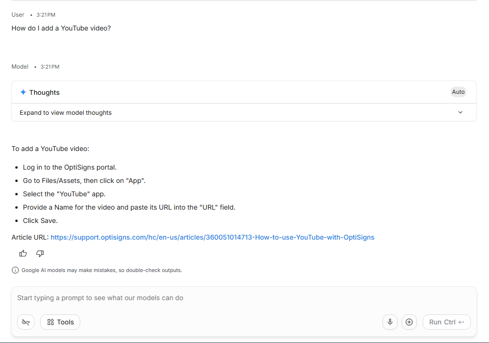

# OptiBot KB Loader

Scrapes OptiSigns help-center articles, tracks them in `manifest.json`, uploads new/updated Markdown to Gemini, and runs as a daily job.

## Setup

```powershell
python -m venv venv
.\venv\Scripts\Activate.ps1
pip install -r requirements.txt
copy .env.sample .env
```

Set `API_KEY=` in `.env`.

## Run locally

```powershell
.\venv\Scripts\python.exe main.py
```

Artifacts/logs:
- `logs/daily_job_latest.json`
- `logs/daily_job_YYYYMMDD_HHMMSS.json`
- `logs/gemini_upload_summary.json`

## Chunking strategy

Each Markdown file is uploaded as one Gemini File API object. Chunk counts are estimated locally for logging: ~1 token ≈ 4 characters, max chunk size **800** tokens, overlap **200** tokens. Gemini handles the actual retrieval indexing server-side; `logs/gemini_upload_summary.json` records `files_uploaded` and `estimated_chunks`.

## Daily job logs (GitHub Actions)

The daily sync runs via workflow `Daily KB Sync` and uploads the `logs/` folder as an artifact named `daily-job`.

Workflow: https://github.com/Catrentroi/testtocry/actions/workflows/daily-sync.yml

To view the latest run output: open the workflow page → click the latest run → download the `daily-job` artifact.

## Docker

```powershell
docker build -t optibot-job .
docker run --rm -e API_KEY="..." -e GEMINI_MODEL="gemini-2.5-flash" -e GEMINI_KB_NAME="optibot-kb" optibot-job
```

## Sample assistant screenshot

Ask in Gemini AI Studio:

```text
How do I add a YouTube video?
```

Use the answer with cited `Article URL:` lines for the screenshot.



## Synchronization

The project uses `manifest.json` as its synchronization state.

For each article it stores:

- article ID
- Markdown filename
- MD5 checksum
- Gemini File ID
- upload timestamp

On each scheduled run:

- New article → Upload
- Modified article (MD5 changed) → Replace Gemini file and upload
- Unchanged article → Skip
- Deleted article → Remove from Gemini and delete from the manifest
